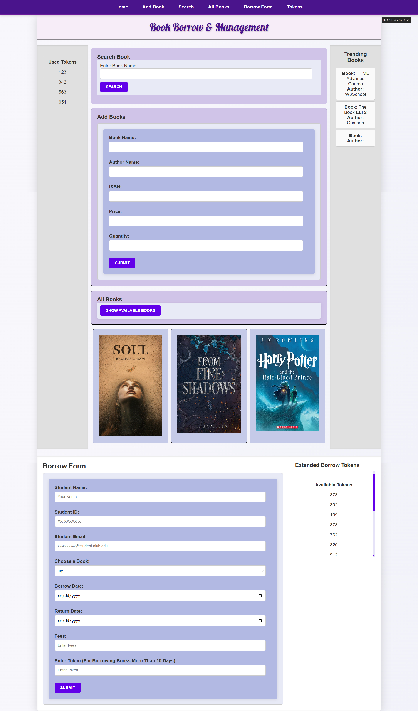

# Book Borrow System  

The **Book Borrow System** is a user-friendly web application designed to streamline the process of borrowing books in a library. It enables users to search for books, manage borrowing details.  

## Key Features  
- Search for books by title  
- Add, update, or delete book records.  
- Borrow books.  
- Track borrowing history using cookies.  
- Check available and used tokens.  
- View recently added books.  
- Display random books in a small section.  
- Display Trending Books in a secton.
- Navigation bar to go through the page easily.

## Screenshots  

### Homepage  
  

## Installation  

Follow these steps to set up the system:  

1. Clone the repository into your XAMPP `htdocs` folder:  
   ```bash  
   git clone https://github.com/LabeebAshhab/WebTechLab.git bookborrow
   ```  
2. Navigate to the project directory:  
   ```bash  
   cd bookborrow 
   ```  
3. Open your browser and visit:  
   ```  
   http://localhost/bookborrow 
   ```  

## How to Use  

1. Use the search bar to find books by title.  
2. After searching select a book to view details, edit, or delete it.  
3. Borrow a book by filling out the form and clicking the "Borrow" button.  
4. Use tokens if the borrowing period exceeds 10 days.  
5. Access a list of your borrowed books and return them when finished.  
6. Borrowing details will be saved as cookies for quick access.  

## Contributing  

If you'd like to contribute, please fork the repository and submit a pull request with your changes.  

## License  

This project is licensed under the **MIT License**. For more details, see the [LICENSE](LICENSE) file.  

## Contact  

For questions or feedback, feel free to reach out via email: [labeebashhabsweeft@gmail.com](mailto:labeebashhabsweeft@gmail.com).  
